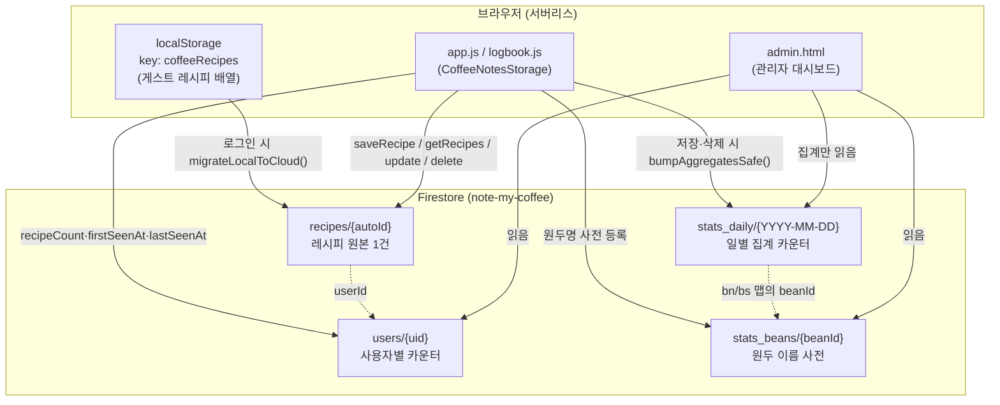

# Note My Coffee — 데이터베이스 스키마

서버 없는 구조다. **Firebase Firestore**(프로젝트 `note-my-coffee`)가 로그인 사용자의 저장소이고,
비로그인(게스트)은 브라우저 **localStorage**에 저장한 뒤 로그인 시 클라우드로 이관된다.
관계형 DB나 자체 백엔드 서버는 없으며, 모든 데이터 접근은 `storage.js`의 `CoffeeNotesStorage`
하나를 거친다. 관리자 대시보드(`admin.html`)는 원본 `recipes`를 훑지 않고 **집계 문서**만 읽는다.

## 구조 다이어그램

## 컬렉션

### `recipes/{autoId}` — 레시피 원본 (핵심 데이터)
레시피 1건 = 문서 1개. 문서 ID는 Firestore가 자동 생성(`addDoc`). 조회는 `where("userId","==",uid)`로
본인 것만, 날짜 내림차순 정렬(`storage.js:getRecipes`). 필드는 `main.js`가 저장 시 구성한다.

| 필드 | 타입 | 의미 |
|---|---|---|
| `userId` | string | 소유자 Firebase Auth uid |
| `date` | ISO string | 추출 시각 |
| `mode` | `'espresso'` \| `'drip'` | 추출 방식 |
| `dosing` | number (g) | 도징량 |
| `temp` | number (°C) | 물 온도 |
| `time` | number (s) | 추출 시간 |
| `yield` | number (g) | 추출량 |
| `beanName` | string | 원두 이름 (필수 입력) |
| `origin` | string | 원산지 |
| `purchaseUrl` | string | 구매처 URL |
| `imageUrl` | string | 겉표지 사진 — **base64 data URL**, ~950KB로 압축 |
| `tasteNotes` | string | 테이스팅 노트 |
| `overallRating` | int 1–5 | 별점 |
| `success` | boolean | 성공 여부 |
| `weather` | string | 추출 시 날씨 |
| `beanStatus` | `'new'` \| `'open'` | 새 봉투 / 개봉 중 |
| `updatedAt` | ISO string | 마지막 쓰기 (storage.js가 추가) |
| `sharedFrom` | boolean? | 공유 링크로 받아 저장한 경우 true |

> 문서 안에는 `id`를 넣지 않는다 — id는 Firestore 문서 ID이고, 읽을 때 `{ id: doc.id, ...doc.data() }`로 합쳐 쓴다.

### `stats_daily/{YYYY-MM-DD}` — 일별 집계
저장·삭제 시점에 `increment(±1)`로만 갱신(원자적, 읽기 불필요). 대시보드가 이 작은 문서만 읽어
원본 `recipes`(사진 base64 포함)를 통째로 내려받지 않게 한다. (`docs/admin-roadmap.md` Phase 1·2)

| 필드 | 의미 |
|---|---|
| `count` | 그날 총 기록 수 |
| `espresso` / `drip` | 모드별 기록 수 |
| `h0` … `h23` | 시간대(0~23시)별 기록 수 |
| `successCount` | 성공 기록 수 |
| `es` / `ds` | 모드별 성공 수 (espresso/drip) |
| `ratedCount`, `rating1`…`rating5` | 평점 분포 |
| `uc` | 맵 `{ uid: n }` — 그날 활동한 사용자 |
| `bn` | 맵 `{ beanId: n }` — 그날 원두별 기록 수 |
| `bs` | 맵 `{ beanId: n }` — 그날 원두별 성공 수 |

### `users/{uid}` — 사용자별 카운터
| 필드 | 의미 |
|---|---|
| `recipeCount` | 누적 기록 수 (`increment`) |
| `firstSeenAt` | 첫 기록일 (최초 1회만 기록) |
| `lastSeenAt` | 마지막 활동 시각 |

### `stats_beans/{beanId}` — 원두 이름 사전
`stats_daily`의 `bn`/`bs` 맵은 ID만 담으므로, 사람이 읽을 이름을 여기서 찾는다.
`beanId`는 원두명을 **FNV-1a 해시**한 값(`storage.js:beanDocId`) — 사용자 입력 원두명을
문서 ID로 바로 쓸 수 없기 때문(`/ . # $ [ ]` 금지·길이 제한).

| 필드 | 의미 |
|---|---|
| `name` | 원두 표시 이름 |

## 게스트 저장소 (localStorage)
- 키 **`coffeeRecipes`** — 레시피 객체 배열(JSON). 로그인 없이 체험 1건 저장 가능(무료 게이트).
- 게스트는 `id`를 `Date.now()` 문자열로 자체 부여한다.
- 로그인하면 `migrateLocalToCloud()`가 `recipes` 컬렉션으로 옮기고 로컬을 비운다 —
  **전부 옮겨진 뒤에만 삭제**하므로 부분 실패로 데이터가 유실되지 않는다.

## 신뢰성 설계
- `getRecipes()` 반환 규약: **배열 = 성공**(빈 배열은 진짜 기록 없음), **`null` = 읽기 실패**.
  일시적 네트워크 오류가 "기록 0건"으로 오인되지 않게 한다.
- Firestore는 IndexedDB **영속 캐시 + 멀티탭 매니저 + 오프라인 큐**(`firebase-config.js`) —
  오프라인 저장이 큐에 남았다가 재연결 시 전송된다.
- 집계(`bumpAggregatesSafe`)는 **부가 기능**이라 실패해도 레시피 저장·삭제 자체는 성공으로 유지된다.

## 보안 규칙
Firestore 보안 규칙은 이 레포의 [`firestore.rules`](../firestore.rules)에 있다(Firebase 콘솔이 최종 소스이니
배포 전 콘솔의 현재 규칙과 비교할 것). 요지: `recipes`·`users`는 **본인만**, `stats_*`는 **관리자만 읽기**.

> **주의 — 집계 무결성**: 현재 `stats_daily`/`stats_beans`는 클라이언트가 직접 쓴다(위 다이어그램).
> 규칙은 로그인 사용자의 쓰기를 허용할 수밖에 없어, 악의적 클라이언트가 통계 카운터를 조작할 여지가 있다
> (분석 전용이라 보안 민감도는 낮음). 무결성이 필요하면 집계를 **Cloud Functions(Admin SDK)** 로 옮기고
> 클라이언트 쓰기를 규칙으로 막는 것이 정석이다.

## 참고 코드
- 데이터 계층: `storage.js` — `getRecipes` / `saveRecipe` / `updateRecipe` / `deleteRecipe` / `migrateLocalToCloud` / `bumpAggregatesSafe` / `beanDocId`
- 레시피 필드 구성: `main.js`(모달 저장 핸들러)
- Firebase 초기화·영속 캐시: `firebase-config.js`
- 대시보드가 읽는 집계: `admin.js` (`docs/admin-roadmap.md`)
